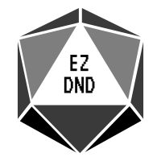

# IMPORTANT
THIS REPO IS ARCHIVED!
AN ACTUAL GOOD LIBRARY IS OVER AT [Macr0Nerd/EZTPLIB](https://github.com/Macr0Nerd/eztplib)!
PLEASE USE THAT!

# EZ D&D
Hi! 
This project was written and made by Gabe Ron.
I has been rebranded as a D&D framework as I hate frontend.
Feel free to add features or contribute.

## How to build
So there are a few steps that need to be taken to use and develop for the libraries.
Firstly, you need to setup C++.

#### Windows
* Download and setup [C++ for VS Code](https://code.visualstudio.com/docs/languages/cpp)
* Download and setup [CMake for VS Code](https://marketplace.visualstudio.com/items?itemName=vector-of-bool.cmake-tools)
* Download and setup [POCO for Windows](https://pocoproject.org/index.html)
(only necessary if you plan on using prebuilt networking class)
* Download the distributable from the Github release manager
* Use the libraries to your heart's content!

Sorry if this explanation is bad; I'm a Linux superuser

#### Linux
* Download g++ from your package manager
* Download cmake from your package manager
* Download POCO from your package manager
* Download the distributable from the Github release manager
* Use the libraries to your heart's content!

For instance, as I use Fedora, the process for me goes:

    sudo dnf install cmake
    sudo dnf install poco-devel
    sudo dnf upgrade
    mkdir EZ-DND/build
    cd EZ-DND/build
    cmake ..
    make

It looks bad but finding the actual package names is the worst part.

#### Notes
* For both Windows and Linux, C++17 is **required**.
The CMake build will crash without it.
Apparently GCC on Ubuntu doesn't have it fully implemented correctly but still reports the CMAKE_CXX_STANDARD flag as 17,
so just to be redundant I have also linked stdc++fs, which is the filesystem library.
This is currently used in the networking classes.
* WARNING: The networking class will soon be deprecated.

## How to use
This is a D&D framework so build your own frontend.

## Contributing
Basically just follow general OSS contribution rules.
Please stick to the code formats I've set(?) with my code.
This includes but is not limited to:
* camelCase
* UPPERCASE CONSTANTS
* Descriptive naming
* Undescriptive naming
* Documentation
* Praising lord G̷̳̼͍̗̪̬̩̲͛͌̽͆̑ ̴̛̖̈́͜͝Ȁ̶̠͉̙͎̤̋̓̍̾͗͝ ̴̡̠̯̺̰͐̊Ṙ̶͓̙͈͉͚̉͂̎ ̵̢͓̫̩̹̦͔̭̽́̃͊́F̶̬͖̙͉̑̔̊̎͋̓͛͘ ̴̧̮̙̙̟͕͌̉̉I̶̜̦͗̽̕ ̸̪̼̋̿̂͑͐͝E̵̢͍̋̑͆̂̎͐̍͝ ̶͉͇̬͙̮͗͌͊̔̈̚L̸̢̤̳͚̠͓̓̿̅̽̅́ͅ ̴̪̼͓́̾̔̇̆̀̆̎Ď̸̙̳͈͕̪̗̿

Overall, just try to find an issue or featurerequest **with triage approved**.
Or you can propose one and see if it gets approved. 
Just work on it and follow the guidelines and we good.

And please use a separate branch.

## License
This is licensed under GNU GPLv3.
Please familiarize yourself with this before you use this code.

## Thanks and Contributions
This project would not be possible without tools such as
* [Catch2](https://github.com/catchorg/Catch2) for testing
* [POCO](https://pocoproject.org/) for a variety of tools
